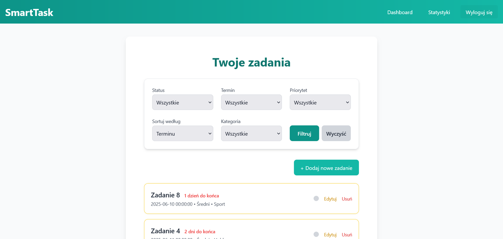
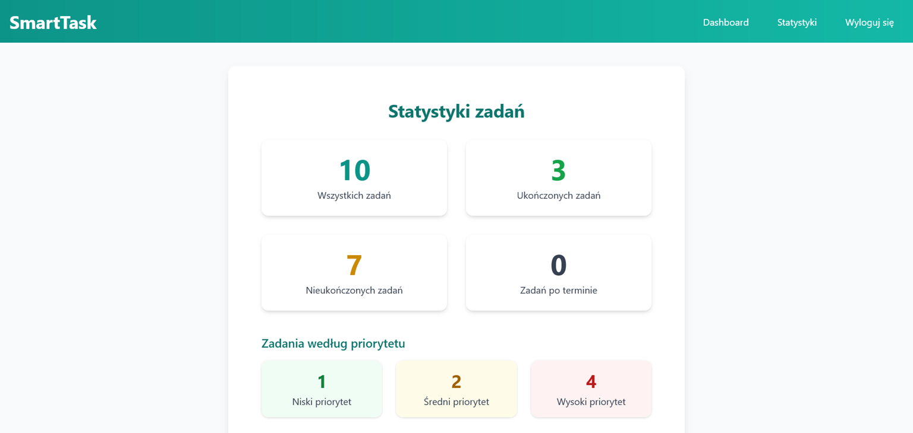
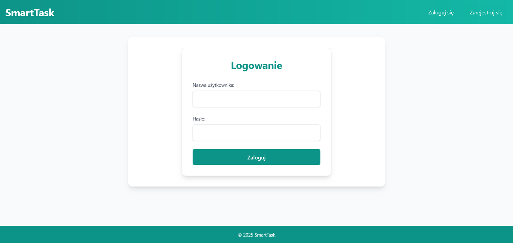
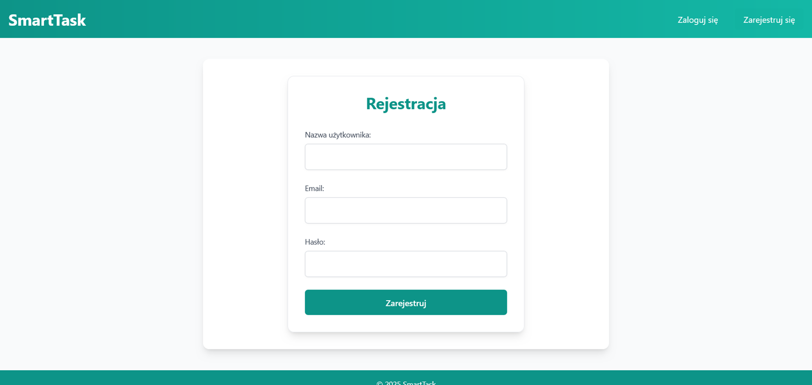
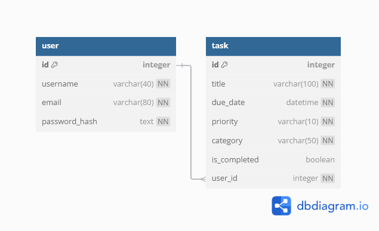

# Dokumentacja projetu: **"SmartTask – Menedżer Zadań"**

## Zespoł projetowy:

_Piotr Gorzkiewicz_ [@g0rzki](https://github.com/g0rzki)

_Dawid Deryło_ [@DVL7](https://github.com/DVL7)

## Opis projektu:

SmartTask to webowa aplikacja do zarządzania zadaniami, umożliwiająca tworzenie, filtrowanie i śledzenie postępów. Projekt oparty jest na Pythonie z wykorzystaniem frameworka Flask, SQLAlchemy oraz Flask-Login. Dane są przechowywane w relacyjnej bazie danych PostgreSQL.

Aplikacja wspiera użytkownika w organizacji codziennych obowiązków dzięki przejrzystemu interfejsowi oraz podstawowym funkcjom analitycznym.

## Zakres projektu opis funkcjonalności:

1. Rejestracja i logowanie – użytkownik może utworzyć konto, zalogować się oraz wylogować.

2. Hashowanie haseł – dane logowania są szyfrowane przy pomocy bezpiecznego algorytmu Werkzeug.

3. Dodawanie zadań – użytkownik może dodać zadanie z nazwą, datą wykonania, priorytetem i kategorią.

4. Edycja i usuwanie zadań – użytkownik może modyfikować lub usuwać zadania w dowolnym momencie.

5. Oznaczanie jako wykonane - wykonane zadania można oznaczyć jako zakończone.

6. Lista zadań – wyświetla wszystkie zapisane zadania w kolejności według terminu.

7. Filtrowanie zadań – zestaw filtrów pokazujący zadania wykonane/nieukończone, o danym terminie, priorytecie lub kategorii.

8. Kolorowe oznaczenia terminów – zadania bliskie terminu oznaczane na żółto (3 dni), na czerwono (1 dzień).

9. Panel statystyk: wszystkie zadania, ukończone, nieukończone, po terminie, podział zadań według priorytetu.

10. Seeder danych testowych - predefiniowane dane do testowania aplikacji i bazy.

## Panele / zakładki aplikacji 

1. Główny szablon aplikacji - zawiera wspólne komponenty strony

2. Dashboard - panel listy zadań z możliwością ich filtrowania

3. Panel statystyk

4. Panel tworzenia nowych zadań

5. Panel logowania

6. Panel rejestracji

###### Grafiki

## Baza danych
###### Diagram ERD

###### Opis bazy danych
Baza danych zawiera dwie tabele:
1. User – przechowuje użytkowników (id, username, email, zahaszowane hasło).
2. Task – przechowuje zadania (id, tytuł, termin, priorytet, kategoria, status ukończenia, powiązanie z użytkownikiem).
   
Relacja jeden do wielu: jeden użytkownik może mieć wiele zadań.

## Wykorzystane biblioteki:
- Python 3.13
- Flask
- Flask-SQLAlchemy
- Flask-Login
- Jinja2
- PostgreSQL
- HTML/Tailwind CSS

## Instrukcja uruchomienia aplikacji
1. **Sklonuj repozytorium:**
   - Pobierz ZIP z GitHuba lub użyj Git GUI, np. GitHub Desktop.

2. **Utwórz bazę danych:**
   - Uruchom pgAdmin lub inny interfejs PostgreSQL.
   - Stwórz nową bazę danych o nazwie `smarttask`.

3. **Skonfiguruj połączenie z bazą w `.env`:**
   - Wartość `twojehaslo` podmień na swoje hasło do pgAdmin.

4. **Uruchom aplikację:**
   - Wpisz `python run.py` w terminalu, mając otwarty projekt w IDE.

5. **Otwórz przeglądarkę:**
   - Wejdź pod ten adres URL http://localhost:5000.
